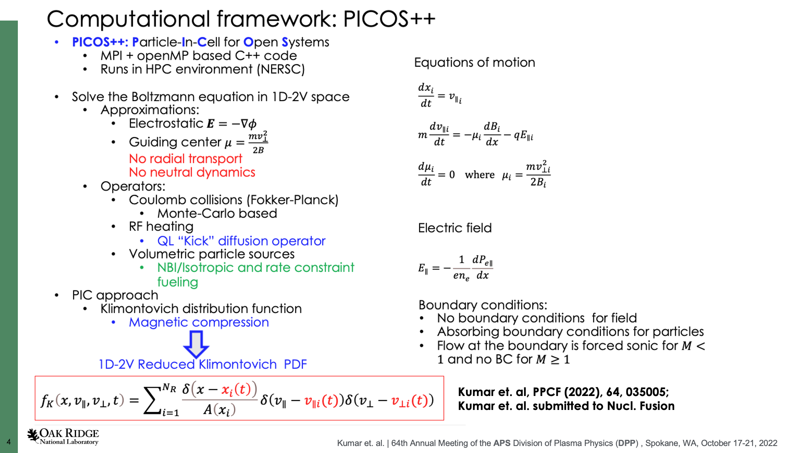

*** * * * * * * * * * * * * * * * * * * * * * * * * * * * * * * * * * * * *
PICOS++, a 1D-2V GC hybrid PIC code for Open plasma Systems        
* * * * * * * * * * * * * * * * * * * * * * * * * * * * * * * * * * * * ***

**LICENSE:**

PICOS++ is free software: you can redistribute it and/or modify it under the terms of the GNU General Public License as published by the Free Software Foundation, either version 3 of the License, or any later version. PICOS++ is distributed in the hope that it will be useful, but WITHOUT ANY WARRANTY; without even the implied warranty of MERCHANTABILITY or FITNESS FOR A PARTICULAR PURPOSE.  See the GNU General Public License for more details.
You should have received a copy of the GNU General Public License along with PICOS++.  If not, see https://www.gnu.org/licenses/.

**TERMS OF USE:**

PICOS++ a free scientific software distributed under the GNU General Public License 3 or later, threfore users and developers are free to use and modify the code at will while ALWAYS complying with the rights and duties that this license confers.
In addition to the above, we ask to use and/or develop the code following standard principles used among the scientific community:

If substantial changes are made to the code, including and/or extending the simulation capacities of PICOS++, we ask the developers to let the community know by generating a pull request within the repo, or emailing Atul Kumar (kumara(at)ornl.gov)
When the use of PICOS++ results in a publication, please acknowledge the code by citing  A. Kumar et. al. Plasma Phys. Control. Fusion 64 (2022) 035012 (17pp); A. Kumar et. al. submitted to Nuclear Fusion (arXiv:2209.09745 [physics.plasm-ph] 2022).

The users of PICOS++ will be the only accountable party for any published work that uses PICOS++ simulation results, therefore, it is encouraged to put in touch with A. Kumar (ORNL) or J. Caneses Marin (compX) to discuss the range of applicability and quality of the simulation results before publishing them.

**GETTING STARTED:**

Install git in your computer.

Move to the directory in your computer where the installation of PICOS++ will be done.

Clone the respository to your computer. Use the option Clone on the top left-hand corner of this page.

A window will pop up showing two options: HTTPS and SSH. You will get something similar to: "git clone https://code.ornl.gov/78k/PICOS.git"

Copy this link in your Terminal. If you want to rename the directory you can do this by including the name of the new directory as follows: "git clone https://code.ornl.gov/78k/PICOS.git new_folder"

You will be asked to enter your password.

cd to your new folder "new_folder".

**INSTALLATION:**

Make sure you have at least half an hour for the installation, it will take some time! This due to the installation of the external libraries.

BEFORE INSTALLING PICOS++
It is important to have the following libraries and programs in your system in order to install PICOS++. Using the software manager of your Linux (Mac) system to get them is always the best option. NOTE: In most cases, these libraries are already installed in Unix/Linux systems. You might try to follow the installation steps below right away.

_CMake:_

You will need mainly two libraries for installing Armadillo C++. BLAS and LAPACK, you are able to use both, static or shared versions of these libraries (it is up to you).
ATLAS
Boost
zlib

_COMPILERS:_

PICOS++ has been successfully compiled on Mac OS 10.6.X and higher and on Linux distributions as Ubuntu and Suse Linux.
There are some know problems when using versions of the GNU Compiller Collection higher than 4.4 when installing versions of HDF5 earlier than 1.8.16. If you are installing 1.8.16 or higher you can use any version of the GNU compilers. Armadillo librairies autofinds intel compilers whereever available (for e.g. NERSC) and  MakeFile must be updated accordingly.

_MAC OS USERS:_

Users/Developers using Mac OS are encouraged to install and use the GNU compilers for building all the external libraries, MPI and compile PICOS++. A useful guide/resource for installing GNU compilers in Mac OS can be found in THIS link.

_HDF5 LIBRARY:_

It is known that using HDF5 in some IBM systems that do not support file locking might produce an error during execution time when trying to create, read from or write to an HDF5 file, this despite that its installation goes well. As a possible solution, is to disable this feature of HDF5 when running the simulation.
For example, if mpirun is used to run the simulation, then we can disable file locking of HDF5 as follows:
mpirun -env HDF5_USE_FILE_LOCKING FALSE ... (the rest of the parameters)
Users using HDF5 versions earlier than 1.8.16 are highly encouraged to follow ALL the installation steps below to avoid problems during the installation. Users using 1.8.16 and higher ONLY follow steps 1, 5, and 6.

_INSTALATION STEPS:_

In a system terminal cd to your repo top folder.
Modify the file INSTALL_PICOS++.sh to include the compilers (including absolute path if not default system compilers) that you will be using. You can modify CC, CPP, CXX, FC, and MPICXX.
In the terminal, type the following command: ". ./INSTALL_PICOS++.sh"
Check for completion status. The installer will install Armadillo C++ first, then HDF5, and finally will build the code.

_PROBLEMS DURING INSTALLATION?_
Please report any problem/bug using the "Issues" section on the left panel.

_RUNNING PICOS++_

export OMP_NUM_THREADS=(number of open MP threads per MPI process)
mpirun -np (even number of MPI processes) bin/PICOS++ /path/to/output/folder/ (ID of input file [optional])

